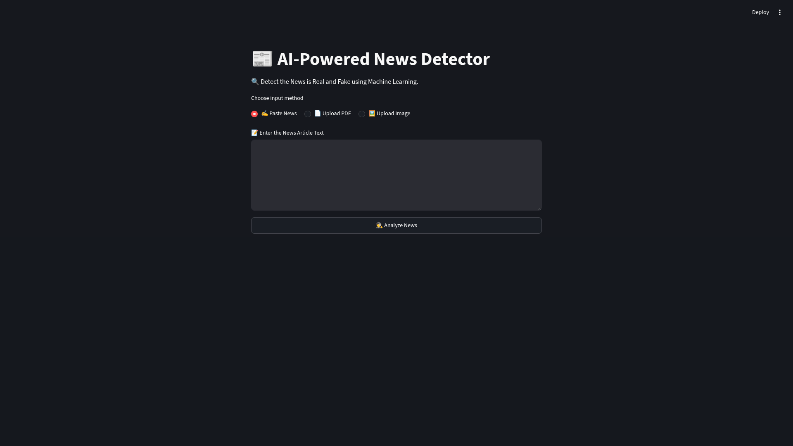
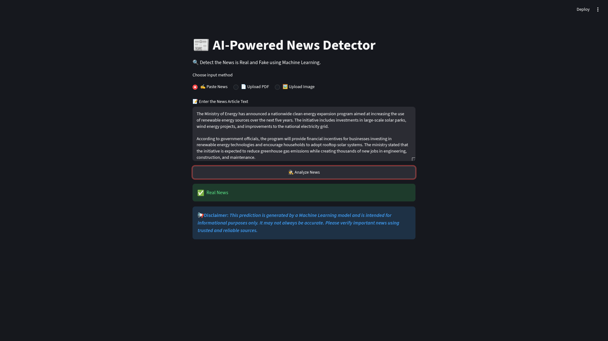
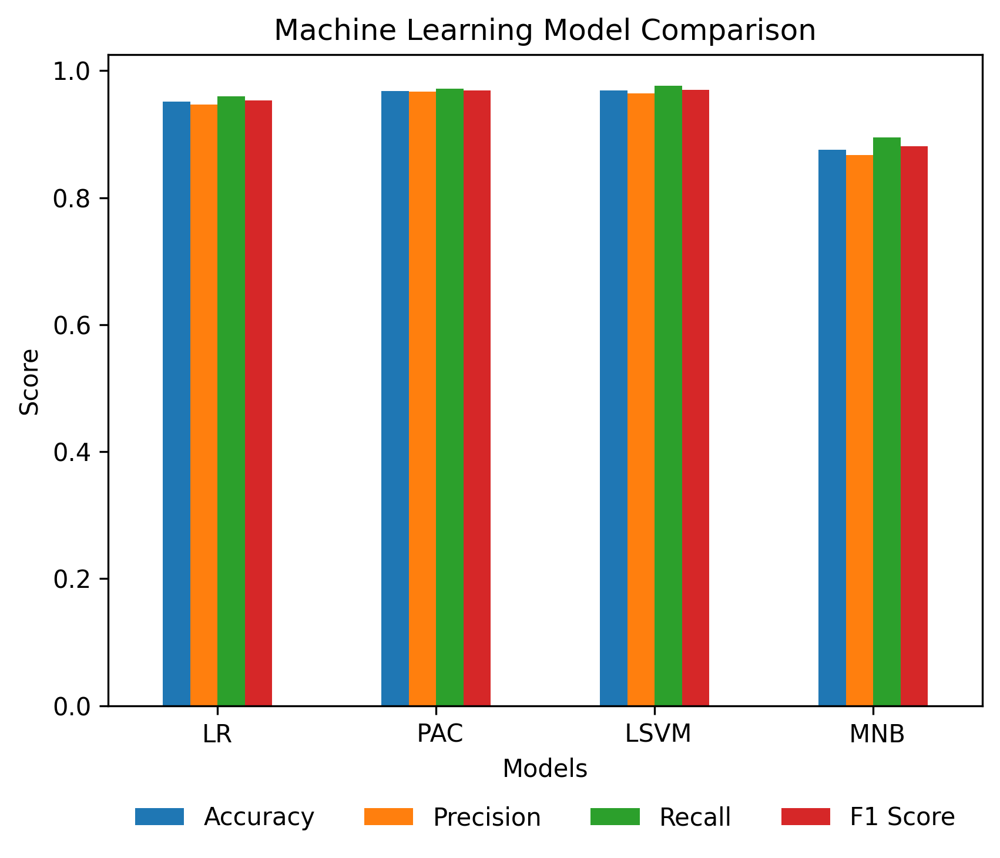
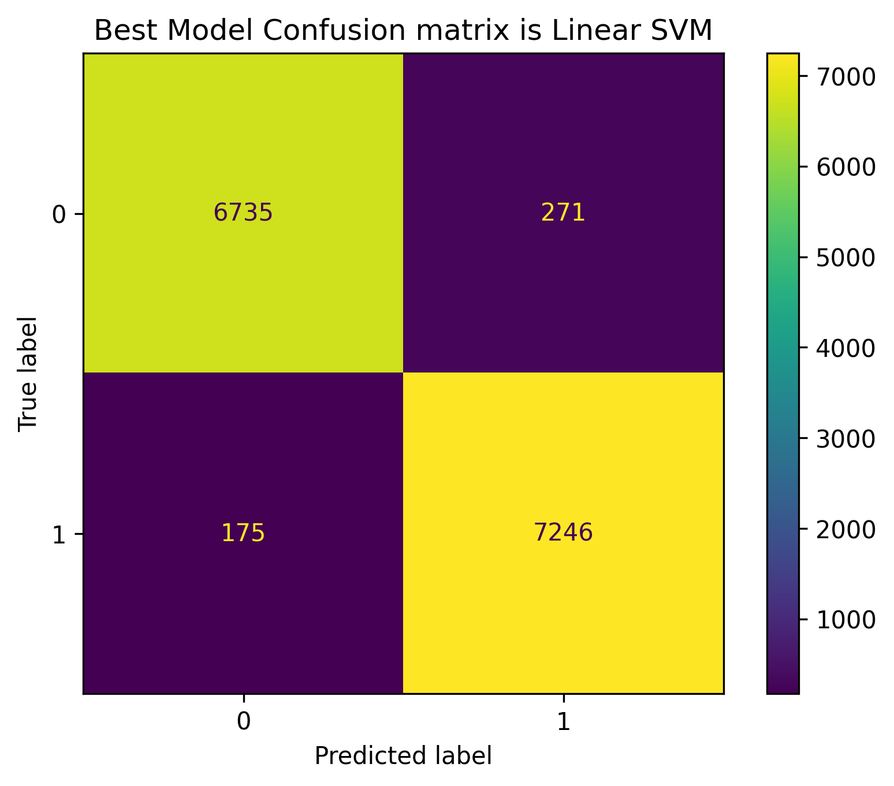

# 📰 AI-Powered Fake News Detection using Machine Learning and Natural Language Processing (NLP)


<p align="center">


</p>

---

## 📌 Overview

**AI-Powered Fake News Detection** is a Machine Learning and Natural Language Processing (NLP) application that classifies news articles as **Real** or **Fake**.

The project combines **TF-IDF Vectorization** with multiple Machine Learning algorithms to identify misleading news content. A user-friendly **Streamlit** web application enables users to verify news articles using text, PDF documents, or images.

---

# ✨ Features

- 🤖 Fake News Detection using Machine Learning
- 📝 Manual Text Prediction
- 📄 PDF Upload & Text Extraction
- 🖼️ OCR-based Image Text Extraction using EasyOCR
- 🧹 Automatic Text Preprocessing
- 📊 TF-IDF Vectorization
- ⚡ Linear SVM Prediction
- 📈 Model Performance Comparison
- 📢 Built-in Prediction Disclaimer
- 🌐 Interactive Streamlit Interface

---

# 🛠️ Tech Stack

| Category | Technology |
|----------|------------|
| Language | Python |
| Web Framework | Streamlit |
| Machine Learning | Scikit-learn |
| NLP | TF-IDF Vectorizer |
| OCR | EasyOCR |
| PDF Processing | PDFPlumber |
| Data Analysis | Pandas, NumPy |
| Visualization | Matplotlib |

---

# 📂 Project Structure

```text
Fake_News_Detection/
│
├── .vscode/
│
│
├── images/
│   ├── confusion_matrix.png
│   ├── home_page.png
│   ├── image_prediction.png
│   ├── model_comparison.png
│   ├── pdf_prediction.png
│   └── text_prediction.png
│
├── model/
│   ├── model.pkl
│   └── tfidf.pkl
│
├── notebook/
│   └── fake_news_detection.ipynb
│
├── sample/
│   ├── fake_news.pdf
│   ├── real_news.png
│   └── real_news.txt
│
├── app.py
├── requirements.txt
└── README.md
```

---

# 📊 Dataset

This project uses the **WELFake Dataset** for training and evaluating the Machine Learning models.

**Dataset Source:**

https://www.kaggle.com/datasets/saurabhshahane/fake-news-classification

### Dataset Information

- 📄 Dataset Name: WELFake Dataset
- 📰 Total Articles: 72,134
- ✅ Real News: 35,028
- ❌ Fake News: 37,106
- 📂 Columns:
  - `title` – News headline
  - `text` – News article content
  - `label` – Target label (`0 = Fake`, `1 = Real`)


⚠️ Note: The dataset is not included in this repository because of size limits.
It can be downloaded directly from Kaggle using KaggleHub.

---

# ⚙️ Machine Learning Pipeline

```
Load Dataset
      │
      ▼
Handle Missing Values
      │
      ▼
Merge Title + Text
      │
      ▼
Text Preprocessing
      │
      ▼
TF-IDF Vectorization
      │
      ▼
Train Machine Learning Models
      │
      ▼
Evaluate Performance
      │
      ▼
Save Best Model
      │
      ▼
Deploy with Streamlit
```

---

# 🧹 Text Preprocessing

The notebook and Streamlit application use the same preprocessing pipeline.

Preprocessing steps:

- Convert text to lowercase
- Remove URLs
- Remove HTML tags
- Remove punctuation
- Remove numbers
- Remove extra whitespace

---

# 🤖 Machine Learning Models

The following models were trained and evaluated:

- Logistic Regression
- Passive Aggressive Classifier
- Linear Support Vector Machine (Linear SVM)
- Multinomial Naive Bayes

---

# 📈 Model Performance

| Model | Accuracy | Precision | Recall | F1 Score |
|:------|---------:|----------:|--------:|---------:|
| Logistic Regression | 95.15% | 94.65% | 96.00% | 95.32% |
| Passive Aggressive Classifier | 96.83% | 96.55% | 97.30% | 96.93% |
| ⭐ Linear SVM | **96.91%** | **96.39%** | **97.64%** | **97.01%** |
| Multinomial Naive Bayes | 87.55% | 86.72% | 89.50% | 88.09% |

> **Best Performing Model:** **Linear SVM**

---

# 🚀 Prediction Workflow

```
User Input
(Text / PDF / Image)
        │
        ▼
Text Extraction
        │
        ▼
Text Preprocessing
        │
        ▼
TF-IDF Vectorization
        │
        ▼
Linear SVM Model
        │
        ▼
Prediction
        │
        ├── ✅ Real News
        └── 🚨 Fake News
```

---

# 📸 Application Preview

## 🏠 Home Page

<p align="center">

</p>

---

## ✍️ Text Prediction

<p align="center">

</p>

---

## 📄 PDF Prediction

<p align="center">

</p>

---

## 🖼️ Image Prediction (OCR)

<p align="center">

</p>

---

## 📊 Model Comparison

<p align="center">

</p>

---

## 📈 Confusion Matrix

<p align="center">

</p>

---

# 📁 Sample Files

Sample files are included for testing all supported input methods.

```text
sample/
├── fake_news.pdf
├── real_news.png
└── real_news.txt
```

These files can be used to test:

- ✍️ Paste Text
- 📄 PDF Upload
- 🖼️ Image Upload (OCR)

---

# 🛠️ Installation

Clone the repository

```bash
git clone https://github.com/Sushantkr99/Fake_News_Detection.git
cd Fake_News_Detection
```

Create a Conda environment

```bash
conda create -n fake_news_env python=3.12
```

Activate the environment

```bash
conda activate fake_news_env
```

Install dependencies

```bash
pip install -r requirements.txt
```

Run the application

```bash
streamlit run app.py
```

---

# 📦 Requirements

- Python 3.12
- Streamlit
- NumPy
- Pandas
- Scikit-learn
- Matplotlib
- EasyOCR
- PDFPlumber
- Pillow

---

# 📢 Disclaimer

This application is developed for **educational and informational purposes only**.

Predictions are generated using a Machine Learning model and may not always be accurate. Always verify important news using trusted and reliable sources before making decisions based on the prediction.

---

# 📄 License

This project is licensed under the **MIT License**.

See the [LICENSE](LICENSE) file for more details.

---

# 👨‍💻 Author

**Sushant Kumar**

🎓 B.Tech Computer Science & Engineering

[](https://github.com/Sushantkr99)

[](https://www.linkedin.com/in/sushant-kumar-307769336/)

---

# ⭐ Support

If you found this project useful, consider giving it a ⭐ on GitHub.

Feedback and suggestions are always welcome.